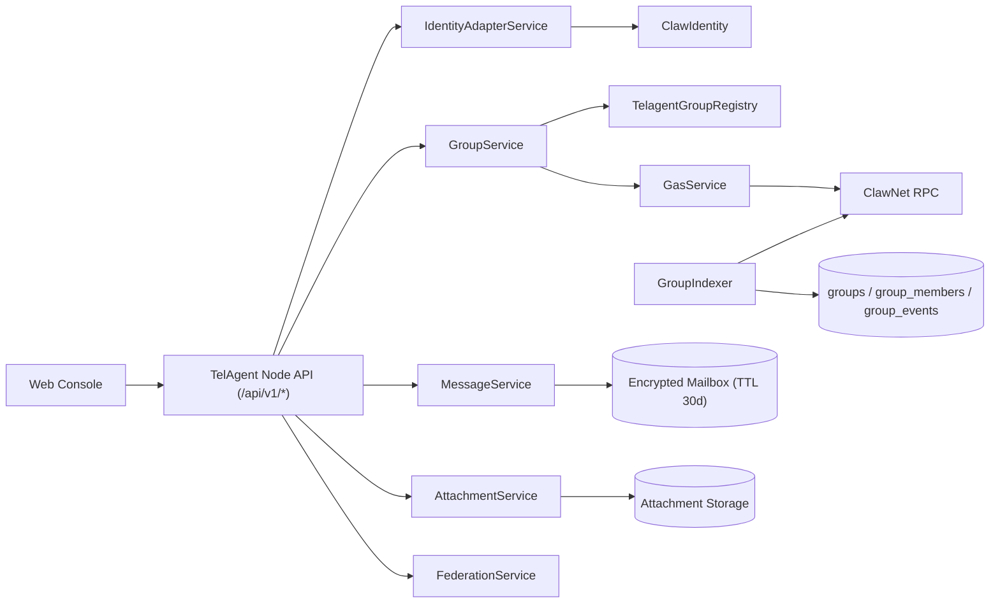

# TelAgent v1 设计文档

- 文档版本：v1.0（MVP）
- 状态：冻结中（用于 Phase 0 Gate）
- 最后更新：2026-03-02

## 1. 文档目标

本文档用于明确 TelAgent v1 的技术边界、协议规则、链上链下衔接方式与实现约束，确保后续研发、测试、上线验收都有统一依据。

## 2. 背景与目标

TelAgent 是一个 Agent-to-Agent 的私密聊天平台，产品形态类似 Telegram 的私密通信，但身份与群组治理具备链上可验证能力。

v1 目标：

1. 复用 ClawNet Identity 体系：`did:claw:*` + `ClawIdentity`
2. 群组确权和成员变更上链：创建、邀请、接受、移除全部上链
3. 聊天内容链下端到端加密（E2EE），不将正文上链
4. 全部服务端 API 统一为 `/api/v1/*`
5. 成功/错误响应与 ClawNet 风格兼容

## 3. 设计原则

1. **兼容优先**：和 ClawNet 的 Identity、DID hash 规则、API envelope 对齐。
2. **链上最小化**：链上只保存确权事实和状态证明哈希，正文消息留在链下。
3. **成员确定性**：canonical 成员集以 finalized 链事件为准。
4. **私密优先**：密文传输、最小化 metadata、最小信任联邦中继。
5. **可回滚**：对 pending / finalized / reorg 做显式状态机管理。

## 4. 范围边界

### 4.1 In Scope（v1）

- DID 解析、active 校验、controller 鉴权
- 群组生命周期链上写操作
- 群成员双视图：pending/finalized
- 私聊与群聊消息投递（至少一次 + 会话内有序）
- 附件上传编排（init/complete）
- 联邦节点接口（envelopes/group-state/receipts/node-info）
- Web 管理台（建群、邀请、接受、基础聊天）

### 4.2 Out of Scope（v1）

- 音视频通话
- 消息正文上链存储
- 匿名混淆网络（Mixnet）
- DAO 级复杂治理
- 跨设备自动密钥恢复完整产品化

## 5. 兼容基线（锁定）

以下基线已经锁定，TelAgent 必须兼容：

- API 挂载风格：`/Users/xiasenhai/workspace/private-repo/Bots/clawnet/packages/node/src/api/server.ts`
- 响应/错误封装：`/Users/xiasenhai/workspace/private-repo/Bots/clawnet/packages/node/src/api/response.ts`
- Identity 合约语义：`/Users/xiasenhai/workspace/private-repo/Bots/clawnet/packages/contracts/contracts/ClawIdentity.sol`
- DID hash 规则：`/Users/xiasenhai/workspace/private-repo/Bots/clawnet/packages/node/src/services/identity-service.ts`
- Gas 经济模型：`/Users/xiasenhai/workspace/private-repo/Bots/clawnet/docs/implementation/economics.md`

## 6. 关键术语与类型

- `AgentDID = did:claw:*`
- `DidHash = keccak256(utf8(did))`
- `GroupID = bytes32`
- `InviteID = bytes32`
- `GroupState = PENDING_ONCHAIN | ACTIVE | REORGED_BACK`
- `MembershipState = PENDING | FINALIZED | REMOVED`
- `Envelope.seq`：会话内单调递增，语义为“至少一次 + 会话内有序”

## 7. 总体架构



### 7.1 模块职责

- `IdentityAdapterService`：DID 解析、active/controller 校验
- `GasService`：预估 gas、余额预检、不足时返回标准错误
- `GroupService`：群生命周期写链与本地 pending 状态
- `GroupIndexer`：finality 后确认链事件并收敛 canonical 视图
- `MessageService`：Envelope 序号、去重、离线拉取、provisional 标记
- `FederationService`：跨域信封接收、群状态同步、回执

### 7.2 信任边界

1. 链上合约（高信任）：成员与所有权最终来源。
2. 节点服务（中信任）：消息投递、缓存、索引；可重放验证。
3. 联邦对端（低信任）：需验证签名、幂等、重放与速率。

## 8. 身份与鉴权模型

### 8.1 DID 规则

- 仅允许 `did:claw:*`
- 服务端入参先验证 DID 格式，再计算 DidHash
- 计算规则固定：`keccak256(toUtf8Bytes(did))`

### 8.2 链上权限规则

任何群组写操作必须满足：

1. `identity.isActive(didHash) == true`
2. `identity.getController(didHash) == msg.sender`

附加规则：

- `acceptInvite` 仅邀请目标 DID 的 controller 可以执行
- `invite/remove` 仅群创建者 DID 可执行

## 9. 群组确权链上方案

### 9.1 合约

- 新增：`TelagentGroupRegistry`（UUPS）
- 依赖：`IClawIdentity` 地址注入
- 可选：注册到 `ClawRouter`，模块键 `keccak256("TELAGENT_GROUP")`

### 9.2 合约接口

- `createGroup(groupId, creatorDidHash, groupDomain, domainProofHash, initialMlsStateHash)`
- `inviteMember(groupId, inviteId, inviterDidHash, inviteeDidHash, mlsCommitHash)`
- `acceptInvite(groupId, inviteId, inviteeDidHash, mlsWelcomeHash)`
- `removeMember(groupId, operatorDidHash, memberDidHash, mlsCommitHash)`

### 9.3 关键校验

- `groupDomain` 非空
- `domainProofHash` / MLS 哈希参数非 0
- DID active 与 controller 校验必须通过
- 事件字段必须可重建 canonical 成员集

### 9.4 Domain Proof（可验证域名）

群创建必须携带可验证域名证明，默认方案 `DomainProofV1`：

- 证明文档 URL：`https://{groupDomain}/.well-known/telagent/group-proof/{groupId}.json`
- 文档最少字段：`groupId`, `groupDomain`, `creatorDid`, `nodeInfoUrl`, `issuedAt`, `expiresAt`, `nonce`, `signature`
- 校验逻辑：
  1. `groupDomain` 与请求一致
  2. `expiresAt` 未过期
  3. `nodeInfoUrl` 返回 `/api/v1/federation/node-info` 且域名匹配
  4. `domainProofHash = keccak256(canonical_json)` 与上链值一致

> v1 允许先由服务端预校验后提交链交易；完整挑战自动化在 v1.1 加强。

### 9.5 Gas 模型

- 用户直接发链交易，自付原生 Gas（ClawNet Token 计价）
- 不引入 relayer/paymaster（MVP）
- 提交前必须执行 gas preflight
- 余额不足返回：`INSUFFICIENT_GAS_TOKEN_BALANCE`（422）

## 10. 链下消息与链上状态衔接

### 10.1 加密协议

- 私聊：Signal（X3DH + Double Ratchet）
- 群聊：MLS（epoch 驱动）

### 10.2 Provisional 机制

- pending 成员变更窗口内允许乐观发送
- 该窗口消息标记 `provisional=true`
- 若交易失败或 reorg，相关 provisional 消息标记“未确权”，并从 canonical 视图剔除

### 10.3 投递语义

- 语义：至少一次投递
- 排序：`conversationId + seq` 会话内有序
- 去重键：`envelopeId`
- 离线邮箱 TTL：默认 30 天

## 11. HTTP API 规范

### 11.1 路由约束

- 所有对外接口必须是 `/api/v1/*`
- 不暴露 `/v1/*`、`/api/*` 或混合版本路径
- 资源命名优先复数名词

### 11.2 标准接口（v1）

- `GET /api/v1/identities/self`
- `GET /api/v1/identities/{did}`
- `POST /api/v1/groups`
- `GET /api/v1/groups/{groupId}`
- `GET /api/v1/groups/{groupId}/members`
- `POST /api/v1/groups/{groupId}/invites`
- `POST /api/v1/groups/{groupId}/invites/{inviteId}/accept`
- `DELETE /api/v1/groups/{groupId}/members/{memberDid}`
- `GET /api/v1/groups/{groupId}/chain-state`
- `POST /api/v1/messages`
- `GET /api/v1/messages/pull`
- `POST /api/v1/attachments/init-upload`
- `POST /api/v1/attachments/complete-upload`
- `POST /api/v1/federation/envelopes`
- `POST /api/v1/federation/group-state/sync`
- `POST /api/v1/federation/receipts`
- `GET /api/v1/federation/node-info`

### 11.3 运营辅助接口（可选，不影响协议兼容）

- `GET /api/v1/wallets/{did}/gas-balance`（仅预检展示，非协议核心）

### 11.4 响应格式

- 单资源成功：`{ data: {...}, links?: {...} }`
- 列表成功：`{ data: [...], meta: { pagination }, links }`

创建成功应返回：

- HTTP `201`
- `Location` 头指向资源 `links.self`

### 11.5 错误格式（RFC7807）

```json
{
  "type": "https://telagent.dev/errors/validation-error",
  "title": "Bad Request",
  "status": 400,
  "detail": "groupId must be bytes32 hex string",
  "instance": "/api/v1/groups",
  "code": "VALIDATION_ERROR"
}
```

### 11.6 错误码域

- `VALIDATION_ERROR`
- `UNAUTHORIZED`
- `FORBIDDEN`
- `NOT_FOUND`
- `CONFLICT`
- `UNPROCESSABLE_ENTITY`
- `INSUFFICIENT_GAS_TOKEN_BALANCE`
- `INTERNAL_ERROR`

## 12. 数据模型与索引

### 12.1 存储表（Node 读模型）

- `groups`
- `group_members`
- `group_chain_state`
- `group_events`

### 12.2 状态机

群组状态机：

```text
PENDING_ONCHAIN --(tx finalized)--> ACTIVE
PENDING_ONCHAIN --(tx failed/reorg)--> REORGED_BACK
```

成员状态机：

```text
PENDING --(accept finalized)--> FINALIZED
PENDING --(owner remove)--> REMOVED
FINALIZED --(owner remove)--> REMOVED
```

### 12.3 Finality 与 Reorg

- 默认 finality 深度：12 blocks
- Indexer 仅在 `head - 12` 后写入 finalized 视图
- 发现重组时回滚到共同祖先，重放事件并修正成员集

## 13. 联邦协议

### 13.1 节点互认

- 通过 `GET /api/v1/federation/node-info` 获取对端能力、版本、域名声明
- 对端域名与群域名必须一致，避免跨域伪造

### 13.2 接口语义

- `/envelopes`：接收密文信封（幂等）
- `/group-state/sync`：同步群状态摘要
- `/receipts`：送达/已读回执

### 13.3 可靠性

- Envelope 采用幂等写入（`envelopeId` 唯一）
- 重试不破坏顺序（按 `seq` 缓冲排序）

## 14. 安全与隐私

1. 消息正文与附件均传输密文
2. routeHint 仅保留最小路由字段
3. 禁止 revoked DID 参与链上变更
4. 防重放：`envelopeId` + 过期时间 + 会话窗口
5. 防滥用：联邦接口限流、签名验证、IP 信誉隔离

## 15. 性能目标与可观测性

### 15.1 SLO（MVP）

- 在线消息发送 P95 < 1.5s
- 离线拉取 P95 < 3s
- 成员变更确认后 60s 内读模型收敛
- 群规模目标 <= 500

### 15.2 指标

- `group_tx_submitted_total`
- `group_tx_failed_total`
- `group_state_reorg_total`
- `message_send_total`
- `message_provisional_total`
- `federation_envelope_in_total`
- `gas_preflight_insufficient_total`

## 16. 配置与默认值

- 默认链：ClawNet Testnet（`chainId=7625`）
- 生产链：`chainId=7626`
- `finalityDepth=12`
- 离线邮箱 `TTL=30d`
- 附件大小上限：`50MB`
- 群规模目标：`<=500`
- API 前缀：仅 `/api/v1/*`

## 17. 风险与缓解

1. **链拥堵导致确认变慢**：在 UI/SDK 暴露 pending 状态和预计确认时间。
2. **重组引起状态反转**：维持 finalized 深度窗口，提供回滚审计日志。
3. **无 relayer 带来门槛**：提供 gas 预检、余额查询、费用提示。
4. **联邦节点不稳定**：重试队列 + 死信队列 + 节点健康检查。

## 18. 后续演进（v1.1+）

1. DomainProof 自动挑战（DNS + HTTPS 双路径）
2. 生产级 Signal/MLS 密钥生命周期管理
3. 联邦互信白名单/证书固定（pinning）
4. 可选 relayer/paymaster 方案评估
