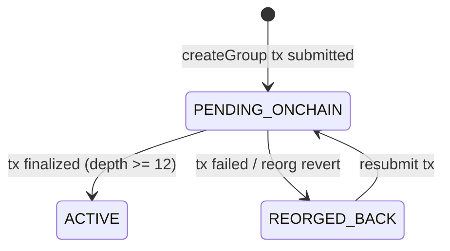
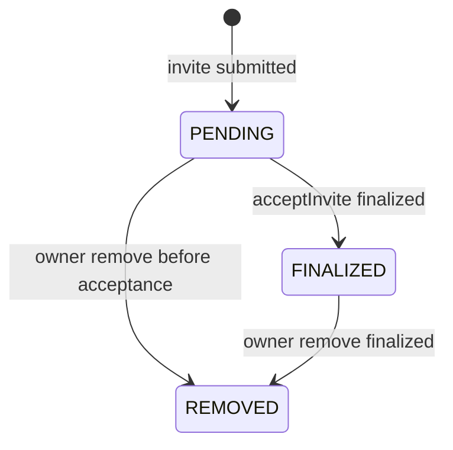

# TA-P0-005 群状态机 RFC（pending/finalized/reorg）

- Task ID：TA-P0-005
- 负责人角色：Backend Engineer
- 状态：DONE
- 冻结日期：2026-03-02

## 1. 目标

固定群组与成员状态转移规则，使 Indexer、API、测试用例可共享同一确定性语义。

## 2. 群组状态机（GroupState）

状态集合：

- `PENDING_ONCHAIN`
- `ACTIVE`
- `REORGED_BACK`

规则：

1. 仅当链事件达到 finality 深度（默认 12）后写入 `ACTIVE`。
2. 任一 pending 交易若失败或被重组回滚，进入 `REORGED_BACK`。
3. `REORGED_BACK` 可通过重新提交流程回到 `PENDING_ONCHAIN`。

## 3. 成员状态机（MembershipState）

状态集合：

- `PENDING`
- `FINALIZED`
- `REMOVED`

规则：

1. `PENDING` 成员仅代表“链上变更已提交但未最终确认”。
2. `FINALIZED` 仅由已 finality 的 `acceptInvite` 事件产生。
3. `REMOVED` 一旦达成即不可逆（v1 无恢复语义）。

## 4. Provisional 消息联动规则

1. 若成员变更处于 `PENDING` 窗口，允许发送 `provisional=true` 消息。
2. 若交易最终 `FINALIZED`，`provisional` 可转正为普通可见消息。
3. 若交易失败或重组，关联 `provisional` 消息必须标记“未确权”并从 canonical 视图剔除。

## 5. API 读取语义

- `GET /api/v1/groups/{groupId}`：返回群组当前视图状态（pending 或 finalized）
- `GET /api/v1/groups/{groupId}/members`：支持读取 pending/finalized 视图
- `GET /api/v1/groups/{groupId}/chain-state`：返回链上确认深度、最近事件高度、reorg 信息

## 6. 验收标准映射

- 状态转移图可被 QA 用例直接引用
- reorg 注入后状态可回滚到共同祖先并重放恢复
- pending/finalized 视图与链状态一致

## 7. 证据

- 设计文档状态机章节：`docs/design/telagent-v1-design.md`（12.2, 12.3）
- 实施计划 Phase 3 目标：`docs/implementation/telagent-v1-implementation-plan.md`（5.4）
