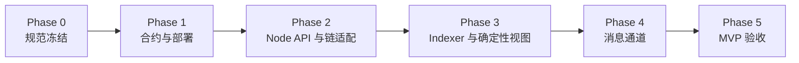

# TelAgent v1 任务拆解（WBS）

- 文档版本：v1.0
- 最后更新：2026-03-03
- 目标：把实施计划落地为可执行、可跟踪、可验收的任务清单

## 1. 使用说明

- **执行顺序**：按 `Phase 0 -> Phase 5` 串行推进，禁止跨 Gate 跳阶段。
- **状态字段**：`TODO | IN_PROGRESS | BLOCKED | DONE`。
- **估算单位**：人日（PD）。
- **依赖格式**：`-` 表示无依赖；多个依赖用逗号分隔任务 ID。
- **验收标准**：必须是可验证结果（测试、文档、脚本、报告）。

## 2. 里程碑依赖图

## 3. 分阶段任务清单

| ID | 阶段 | 任务 | 负责人角色 | 预估(PD) | 依赖 | 输出物 | 验收标准 | 状态 |
| --- | --- | --- | --- | --- | --- | --- | --- | --- |
| TA-P0-001 | Phase 0 | 冻结 API 路径规则（仅 `/api/v1/*`） | Protocol Owner | 0.5 | - | API 规范章节 | 路径清单评审通过 | DONE |
| TA-P0-002 | Phase 0 | 冻结成功/错误 envelope 规范 | Protocol Owner | 0.5 | TA-P0-001 | 响应规范文档 | 示例请求通过契约测试 | DONE |
| TA-P0-003 | Phase 0 | 冻结错误码字典与 HTTP 映射 | Protocol Owner | 0.5 | TA-P0-002 | 错误码清单 | RFC7807 示例全覆盖 | DONE |
| TA-P0-004 | Phase 0 | 冻结 DID hash 与 controller 鉴权规则 | Security Engineer | 0.5 | - | 身份鉴权 RFC | 与 ClawNet 规则逐项对齐 | DONE |
| TA-P0-005 | Phase 0 | 输出群状态机 RFC（pending/finalized/reorg） | Backend Engineer | 1 | TA-P0-004 | 状态机文档 | 状态转移图评审通过 | DONE |
| TA-P0-006 | Phase 0 | 输出 DomainProofV1 规范 | Security Engineer | 1 | TA-P0-005 | 域名验证规范 | 覆盖字段、校验、过期策略 | DONE |
| TA-P0-007 | Phase 0 | 冻结测试策略（合约/API/集成/E2E） | QA Engineer | 1 | TA-P0-003, TA-P0-005 | 测试策略文档 | 阶段 Gate 可执行 | DONE |
| TA-P0-008 | Phase 0 | 建立阶段 Gate 模板与评审机制 | PM/Tech Lead | 0.5 | TA-P0-007 | Gate 模板 | 每阶段有明确通过条件 | DONE |

| TA-P1-001 | Phase 1 | 合约接口审查与签字 | Chain Engineer | 0.5 | TA-P0-004, TA-P0-005 | 接口审查记录 | 函数签名冻结 | DONE |
| TA-P1-002 | Phase 1 | 实现 `TelagentGroupRegistry` 核心存储/校验 | Chain Engineer | 2 | TA-P1-001 | 合约代码 | 核心流程可编译部署 | DONE |
| TA-P1-003 | Phase 1 | 实现权限约束（active/controller/owner） | Chain Engineer | 1 | TA-P1-002 | 合约逻辑补齐 | 非法调用全部回退 | DONE |
| TA-P1-004 | Phase 1 | 实现事件模型（可重建成员集） | Chain Engineer | 1 | TA-P1-002 | 事件定义 | 事件字段满足重建需求 | DONE |
| TA-P1-005 | Phase 1 | 编写合约单元测试：正向流程 | QA + Chain Engineer | 1.5 | TA-P1-003, TA-P1-004 | 合约测试用例 | create/invite/accept/remove 全绿 | DONE |
| TA-P1-006 | Phase 1 | 编写合约单元测试：异常流程 | QA + Chain Engineer | 1.5 | TA-P1-003 | 合约测试用例 | 非 controller / revoked / 重复操作全绿 | DONE |
| TA-P1-007 | Phase 1 | 编写部署脚本（local/testnet） | Chain Engineer | 1 | TA-P1-002 | deploy script | 可重复部署且输出地址 | DONE |
| TA-P1-008 | Phase 1 | 编写回滚脚本与 Runbook | Chain Engineer | 1 | TA-P1-007 | rollback script + runbook | 在测试网完成回滚演练 | DONE |
| TA-P1-009 | Phase 1 | 产出 ABI 与地址清单 | Chain Engineer | 0.5 | TA-P1-007 | ABI/manifest | 下游可直接集成调用 | DONE |
| TA-P1-010 | Phase 1 | （可选）注册 ClawRouter 模块 | Chain Engineer | 0.5 | TA-P1-009 | router 注册脚本 | 模块查询可见 | TODO |
| TA-P1-011 | Phase 1 | 合约阶段 Gate 评审 | PM/Tech Lead | 0.5 | TA-P1-005, TA-P1-006, TA-P1-008 | Gate 结论 | Phase 1 正式关闭 | DONE |

| TA-P2-001 | Phase 2 | 搭建 API Server 与路由挂载 | Backend Engineer | 1 | TA-P0-001 | API 框架代码 | 所有核心路由在 `/api/v1/*` | DONE |
| TA-P2-002 | Phase 2 | 实现响应封装（单资源/列表/Location） | Backend Engineer | 1 | TA-P0-002, TA-P2-001 | response 模块 | 契约测试通过 | DONE |
| TA-P2-003 | Phase 2 | 实现 RFC7807 错误处理链路 | Backend Engineer | 1 | TA-P0-003, TA-P2-001 | error/handler 模块 | 错误响应字段完整 | DONE |
| TA-P2-004 | Phase 2 | 实现 IdentityAdapterService | Backend Engineer | 1 | TA-P0-004, TA-P1-009 | 身份适配服务 | active/controller 校验可用 | DONE |
| TA-P2-005 | Phase 2 | 实现 GasService 与余额预检 | Backend Engineer | 1 | TA-P2-004 | gas 预检服务 | 余额不足返回标准错误 | DONE |
| TA-P2-006 | Phase 2 | 实现 GroupService 链上写流程 | Backend Engineer | 2 | TA-P2-004, TA-P2-005 | group service | create/invite/accept/remove 可执行 | DONE |
| TA-P2-007 | Phase 2 | 实现 `identities*` 与 `groups*` API | Backend Engineer | 1.5 | TA-P2-006 | route handlers | 所有必选接口可访问 | DONE |
| TA-P2-008 | Phase 2 | 实现 messages/attachments/federation API 骨架 | Backend Engineer | 2 | TA-P2-002, TA-P2-003 | route handlers | 基础请求可收发 | DONE |
| TA-P2-009 | Phase 2 | API 契约测试（路径+envelope+错误） | QA Engineer | 1.5 | TA-P2-007, TA-P2-008 | API test suite | 契约测试全绿 | DONE |
| TA-P2-010 | Phase 2 | 集成测试（真实 ClawIdentity + 测试链） | QA + Backend | 2 | TA-P2-006, TA-P1-009 | integration tests | 建群到成员变更闭环通过 | DONE |
| TA-P2-011 | Phase 2 | Node API 阶段 Gate 评审 | PM/Tech Lead | 0.5 | TA-P2-009, TA-P2-010 | Gate 结论 | Phase 2 正式关闭 | DONE |

| TA-P3-001 | Phase 3 | 设计并创建索引存储表结构 | Backend Engineer | 1 | TA-P2-006 | DB schema | `groups/group_members/group_events` 就绪 | DONE |
| TA-P3-002 | Phase 3 | 实现 GroupIndexer 事件订阅与解码 | Backend Engineer | 2 | TA-P1-009, TA-P3-001 | indexer service | 事件可持续入库 | DONE |
| TA-P3-003 | Phase 3 | 实现 pending/finalized 双视图查询 | Backend Engineer | 1.5 | TA-P3-002 | 查询逻辑/API | 同一群可切换两种视图 | DONE |
| TA-P3-004 | Phase 3 | 实现 finalityDepth 处理逻辑 | Backend Engineer | 1 | TA-P3-002 | finality 逻辑 | 仅确认后写 finalized | DONE |
| TA-P3-005 | Phase 3 | 实现 reorg 检测与回滚重放 | Backend Engineer | 2 | TA-P3-004 | rollback/replay 逻辑 | 重组后状态可一致恢复 | DONE |
| TA-P3-006 | Phase 3 | 编写 reorg 注入测试 | QA Engineer | 1.5 | TA-P3-005 | reorg tests | 注入测试全绿 | DONE |
| TA-P3-007 | Phase 3 | 一致性巡检脚本（链上 vs 读模型） | Backend Engineer | 1 | TA-P3-003, TA-P3-005 | consistency checker | 巡检误差率为 0 | DONE |
| TA-P3-008 | Phase 3 | Indexer 阶段 Gate 评审 | PM/Tech Lead | 0.5 | TA-P3-006, TA-P3-007 | Gate 结论 | Phase 3 正式关闭 | DONE |

| TA-P4-001 | Phase 4 | Signal/MLS 适配层接口冻结 | Protocol Owner | 1 | TA-P0-005 | 协议接口文档 | 参数与状态机一致 | DONE |
| TA-P4-002 | Phase 4 | 实现 Envelope 序号生成与单调保障 | Backend Engineer | 1 | TA-P4-001 | seq allocator | 会话内 seq 单调递增 | DONE |
| TA-P4-003 | Phase 4 | 实现 Envelope 去重与幂等写入 | Backend Engineer | 1 | TA-P4-002 | dedupe store | 重复 envelope 不重复投递 | DONE |
| TA-P4-004 | Phase 4 | 实现离线邮箱 TTL 清理任务 | Backend Engineer | 1 | TA-P4-003 | mailbox cleaner | 超时消息按策略清理 | DONE |
| TA-P4-005 | Phase 4 | 实现 provisional 消息标记/剔除逻辑 | Backend Engineer | 1.5 | TA-P3-005, TA-P4-003 | provisional handler | 失败/reorg 后可剔除 | DONE |
| TA-P4-006 | Phase 4 | 实现附件 init/complete 与清单校验 | Backend Engineer | 1.5 | TA-P2-008 | attachment service | 50MB 限制与校验生效 | DONE |
| TA-P4-007 | Phase 4 | 实现联邦接口鉴权/限流/重试 | Security + Backend | 2 | TA-P2-008 | federation hardening | 恶意重放与洪泛可控 | DONE |
| TA-P4-008 | Phase 4 | 实现 node-info 域名一致性校验 | Security Engineer | 1 | TA-P0-006, TA-P4-007 | domain verify logic | 域名与节点声明一致 | DONE |
| TA-P4-009 | Phase 4 | E2E：A 建群 -> 邀请 B -> B 接受 -> 群聊 | QA Engineer | 2 | TA-P4-005, TA-P4-006 | E2E suite | 主链路全绿 | DONE |
| TA-P4-010 | Phase 4 | E2E：离线 24h 拉取 + 去重排序 | QA Engineer | 1.5 | TA-P4-004, TA-P4-009 | E2E suite | 离线场景稳定通过 | DONE |
| TA-P4-011 | Phase 4 | 压测（<=500 成员群） | SRE + QA | 2 | TA-P4-009 | 压测报告 | 核心 SLO 达到目标 | DONE |
| TA-P4-012 | Phase 4 | 消息通道阶段 Gate 评审 | PM/Tech Lead | 0.5 | TA-P4-010, TA-P4-011 | Gate 结论 | Phase 4 正式关闭 | DONE |

| TA-P5-001 | Phase 5 | Web 管理台打通建群/邀请/接受/聊天 | Frontend Engineer | 2 | TA-P4-009 | Web 功能闭环 | 全流程可操作可演示 | DONE |
| TA-P5-002 | Phase 5 | 监控面板与告警规则落地 | SRE/DevOps | 1.5 | TA-P4-011 | Dashboard + Alert | 指标/告警可用 | DONE |
| TA-P5-003 | Phase 5 | 故障注入演练（链拥堵/reorg/联邦故障） | QA + SRE | 1.5 | TA-P5-002 | 演练报告 | 演练项全部可恢复 | DONE |
| TA-P5-004 | Phase 5 | 安全评审与上线检查清单 | Security Engineer | 1 | TA-P5-003 | Security checklist | 高危风险清零 | DONE |
| TA-P5-005 | Phase 5 | 发布 Readiness 报告（Go/No-Go） | PM/Tech Lead | 1 | TA-P5-001, TA-P5-004 | readiness report | 审批通过可发布 | DONE |
| TA-P5-006 | Phase 5 | MVP 验收签字与版本冻结 | PM/Tech Lead | 0.5 | TA-P5-005 | 验收记录 | Phase 5 正式关闭 | DONE |
| TA-RLS-001 | Release | 发布前置检查（Tag 前校验） | Release Owner | 0.5 | TA-P5-006 | preflight report | 结论 READY_FOR_TAG | DONE |
| TA-RLS-002 | Release | 创建 `v0.1.0` 标签与发布说明 | Release Owner | 0.5 | TA-RLS-001 | tag + release note | 标签推送成功并归档证据 | DONE |
| TA-P6-001 | Phase 6 | 离线邮箱持久化（修复重启丢消息风险） | Backend Engineer | 1 | TA-RLS-002 | mailbox repository + checks | 重启后消息可读且序号连续 | DONE |
| TA-P6-002 | Phase 6 | 多实例共享 mailbox state 方案设计 | Backend Engineer + SRE | 1 | TA-P6-001 | ADR + rollout plan | 明确存储/锁/一致性策略 | DONE |
| TA-P6-003 | Phase 6 | mailbox store 外置化实现（SQLite->Postgres 可选） | Backend Engineer | 2 | TA-P6-002 | storage adapter | 多实例读写一致性验证通过 | TODO |
| TA-P6-004 | Phase 6 | 发布后稳定性回归与 Gate | QA + TL | 0.5 | TA-P6-003 | regression report + gate | Phase 6 风险收口关闭 | TODO |

## 4. 执行节奏建议（按部就班）

1. 每周一更新本 WBS 状态（至少更新一次）。
2. 每个 Phase 末执行 Gate Review：未通过不得进入下一阶段。
3. 高优先级缺陷（P0/P1）必须在当前阶段清零。
4. 每个 DONE 任务必须附带证据链接（测试报告、PR、部署记录）。

## 5. 验收证据模板

建议每个任务附加以下证据：

- 代码提交或 PR 链接
- 自动化测试输出
- 文档或报告路径
- 回滚验证记录（如涉及链上变更）

## 6. Day 1 执行记录（2026-03-02）

> 统一回报格式：Task ID / 状态 / 证据链接 / 阻塞项 / 下一步动作

| Task ID | 状态 | 证据链接 | 阻塞项 | 下一步动作 |
| --- | --- | --- | --- | --- |
| TA-P0-001 | DONE | `docs/implementation/phase-0/ta-p0-001-api-path-freeze.md` | 无 | 进入 Phase 2 API 路由实现前复用此清单做静态检查 |
| TA-P0-002 | DONE | `docs/implementation/phase-0/ta-p0-002-envelope-freeze.md` | 无 | 在 Phase 2 契约测试中固化成功/错误 envelope 断言 |
| TA-P0-003 | DONE | `docs/implementation/phase-0/ta-p0-003-error-code-dictionary.md` | 无 | 在 API 错误处理中映射固定 code 与 type URI |
| TA-P0-004 | DONE | `docs/implementation/phase-0/ta-p0-004-did-auth-rfc.md` | 无 | 在 IdentityAdapter 中按固定顺序实现 active/controller 校验 |
| TA-P0-005 | DONE | `docs/implementation/phase-0/ta-p0-005-group-state-machine-rfc.md` | 无 | Phase 3 Indexer 与 reorg 测试直接引用状态机图 |
| TA-P0-006 | DONE | `docs/implementation/phase-0/ta-p0-006-domain-proof-v1-spec.md` | 无 | Phase 2/4 联邦和建群流程中实现域名一致性校验 |
| TA-P0-007 | DONE | `docs/implementation/phase-0/ta-p0-007-test-strategy.md`, `docs/implementation/phase-0/day1-baseline-check.md`, `docs/implementation/phase-0/logs/2026-03-02-pnpm-install-escalated.log`, `docs/implementation/phase-0/logs/2026-03-02-pnpm-build-escalated.log`, `docs/implementation/phase-0/logs/2026-03-02-pnpm-test-escalated-unrestricted.log` | 无 | 维持日志归档，供 Gate 复核引用 |
| TA-P0-008 | DONE | `docs/implementation/phase-0/ta-p0-008-gate-mechanism.md`, `docs/implementation/gates/phase-0-gate.md`, `docs/implementation/gates/phase-0-risk-register.md`, `docs/implementation/phase-0/week1-closeout-execution-plan.md`, `docs/implementation/phase-0/week1-progress-2026-03-02.md` | 无 | Week 2 按计划启动 `TA-P1-001`（不提前切阶段开发） |

## 7. Phase 1 启动准备（2026-03-02）

| Task ID | 状态 | 证据链接 | 阻塞项 | 下一步动作 |
| --- | --- | --- | --- | --- |
| TA-P1-001 | DONE | `docs/implementation/phase-1/ta-p1-001-contract-interface-review-2026-03-02.md`, `docs/implementation/phase-1/README.md` | 无 | 启动 `TA-P1-002` 实现与最小验收闭环 |
| TA-P1-002 | DONE | `docs/implementation/phase-1/ta-p1-002-implementation-checkpoint-2026-03-02.md`, `docs/implementation/phase-1/ta-p1-002-deploy-check-2026-03-02.md` | 无 | 进入 `TA-P1-003` / `TA-P1-004` 验收补齐 |
| TA-P1-003 | DONE | `docs/implementation/phase-1/ta-p1-003-permission-constraint-checkpoint-2026-03-02.md`, `docs/implementation/phase-1/ta-p1-003-test-run-2026-03-02.md`, `packages/contracts/test/TelagentGroupRegistry.test.ts` | 无 | 进入 TA-P1-005/TA-P1-006 测试收敛 |
| TA-P1-004 | DONE | `docs/implementation/phase-1/ta-p1-004-event-model-checkpoint-2026-03-02.md`, `docs/implementation/phase-1/ta-p1-001-contract-interface-review-2026-03-02.md` | 无 | 进入 TA-P1-005/TA-P1-006 测试收敛 |
| TA-P1-005 | DONE | `docs/implementation/phase-1/ta-p1-005-positive-test-report-2026-03-02.md`, `packages/contracts/test/TelagentGroupRegistry.test.ts` | 无 | 进入 TA-P1-007 部署阶段 |
| TA-P1-006 | DONE | `docs/implementation/phase-1/ta-p1-006-negative-test-report-2026-03-02.md`, `docs/implementation/phase-1/ta-p1-003-test-run-2026-03-02.md` | 无 | 进入 TA-P1-007 部署阶段 |
| TA-P1-007 | DONE | `packages/contracts/scripts/deploy-telagent-group-registry.ts`, `docs/implementation/phase-1/ta-p1-007-deploy-script-checkpoint-2026-03-02.md`, `docs/implementation/phase-1/manifests/2026-03-02-local-deploy-manifest.json`, `docs/implementation/phase-1/manifests/2026-03-02-testnet-deploy-manifest.json`, `docs/implementation/phase-1/manifests/2026-03-02-testnet-deploy-success.txt` | 无 | 进入 `TA-P1-008`/`TA-P1-009` 收口与 Gate 准备 |
| TA-P1-008 | DONE | `packages/contracts/scripts/rollback-telagent-group-registry.ts`, `packages/contracts/scripts/rollback-drill-local.ts`, `docs/implementation/phase-1/ta-p1-008-rollback-runbook-2026-03-02.md`, `docs/implementation/phase-1/manifests/2026-03-02-local-rollback-drill.json`, `docs/implementation/phase-1/manifests/2026-03-02-testnet-rollback-drill.json`, `docs/implementation/phase-1/manifests/2026-03-02-testnet-rollback-drill.txt` | 无 | 进入 `TA-P1-011` Gate 材料汇总 |
| TA-P1-009 | DONE | `docs/implementation/phase-1/ta-p1-009-abi-address-manifest-2026-03-02.md`, `docs/implementation/phase-1/manifests/2026-03-02-telagent-group-registry-abi.json`, `docs/implementation/phase-1/manifests/2026-03-02-local-deploy-manifest.json`, `docs/implementation/phase-1/manifests/2026-03-02-testnet-deploy-manifest.json`, `docs/implementation/phase-1/manifests/2026-03-02-deploy-manifest.json` | 无 | 如需继续，执行 `TA-P1-010`（可选）或直接进入 `TA-P1-011` |
| TA-P1-011 | DONE | `docs/implementation/gates/phase-1-gate.md`, `docs/implementation/phase-1/README.md`, `docs/implementation/phase-1/manifests/2026-03-02-deploy-manifest.json` | 无 | Phase 1 已正式关闭，允许按 Gate 结论进入 Phase 2 |

## 8. Phase 2 收口执行（2026-03-02）

| Task ID | 状态 | 证据链接 | 阻塞项 | 下一步动作 |
| --- | --- | --- | --- | --- |
| TA-P2-001 | DONE | `docs/implementation/phase-2/ta-p2-001-api-server-route-mount-2026-03-02.md`, `packages/node/src/api/server.ts`, `packages/node/src/api/router.ts`, `packages/node/src/api-prefix.test.ts`, `docs/implementation/phase-2/logs/2026-03-02-p2-api-contract-test.txt` | 无 | 继续推进 `TA-P2-004` / `TA-P2-005` |
| TA-P2-002 | DONE | `docs/implementation/phase-2/ta-p2-002-response-envelope-checkpoint-2026-03-02.md`, `packages/node/src/api/response.ts`, `packages/node/src/api/routes/messages.ts`, `packages/node/src/api/routes/groups.ts`, `packages/node/src/api-contract.test.ts` | 无 | 继续推进 `TA-P2-008`（消息/附件/联邦路由收口） |
| TA-P2-003 | DONE | `docs/implementation/phase-2/ta-p2-003-rfc7807-error-pipeline-2026-03-02.md`, `packages/protocol/src/errors.ts`, `packages/node/src/api/route-utils.ts`, `packages/node/src/api/response.ts`, `packages/node/src/api-contract.test.ts` | 无 | 继续推进 `TA-P2-009` 契约测试扩展与汇总 |
| TA-P2-004 | DONE | `docs/implementation/phase-2/ta-p2-004-identity-adapter-service-2026-03-02.md`, `packages/node/src/services/identity-adapter-service.ts`, `packages/node/src/api/routes/identities.ts` | 无 | 继续推进 `TA-P2-005` / `TA-P2-006` |
| TA-P2-005 | DONE | `docs/implementation/phase-2/ta-p2-005-gas-service-preflight-2026-03-02.md`, `packages/node/src/services/gas-service.ts`, `packages/node/src/services/gas-service.test.ts`, `docs/implementation/phase-2/logs/2026-03-02-p2-node-test.txt` | 无 | 继续推进 `TA-P2-006` 链上流程联调 |
| TA-P2-006 | DONE | `docs/implementation/phase-2/ta-p2-006-group-service-onchain-writeflow-2026-03-02.md`, `packages/node/src/services/group-service.ts`, `docs/implementation/phase-2/manifests/2026-03-02-p2-testnet-integration.json` | 无 | 继续推进 `TA-P2-007` / `TA-P2-010` |
| TA-P2-007 | DONE | `docs/implementation/phase-2/ta-p2-007-identities-groups-api-2026-03-02.md`, `packages/node/src/api/routes/identities.ts`, `packages/node/src/api/routes/groups.ts`, `packages/node/src/api/router.ts` | 无 | 继续推进 `TA-P2-009` |
| TA-P2-008 | DONE | `docs/implementation/phase-2/ta-p2-008-messages-attachments-federation-skeleton-2026-03-02.md`, `packages/node/src/api/routes/messages.ts`, `packages/node/src/api/routes/attachments.ts`, `packages/node/src/api/routes/federation.ts` | 无 | 继续推进 `TA-P2-009` |
| TA-P2-009 | DONE | `docs/implementation/phase-2/ta-p2-009-api-contract-test-suite-2026-03-02.md`, `packages/node/src/api-contract.test.ts`, `packages/node/src/api-prefix.test.ts`, `packages/node/package.json`, `docs/implementation/phase-2/logs/2026-03-02-p2-node-build.txt`, `docs/implementation/phase-2/logs/2026-03-02-p2-node-test.txt` | 无 | 进入 `TA-P2-011` Gate 材料汇总 |
| TA-P2-010 | DONE | `docs/implementation/phase-2/ta-p2-010-testnet-integration-2026-03-02.md`, `packages/node/scripts/run-phase2-testnet-integration.ts`, `docs/implementation/phase-2/logs/2026-03-02-p2-testnet-integration-run.txt`, `docs/implementation/phase-2/manifests/2026-03-02-p2-testnet-integration.json` | 无 | 进入 `TA-P2-011` Gate 评审 |
| TA-P2-011 | DONE | `docs/implementation/gates/phase-2-gate.md`, `docs/implementation/phase-2/README.md` | 无 | Phase 2 已正式关闭，按 Gate 结论进入 Phase 3 |

## 9. Phase 3 收口执行（2026-03-02）

| Task ID | 状态 | 证据链接 | 阻塞项 | 下一步动作 |
| --- | --- | --- | --- | --- |
| TA-P3-001 | DONE | `docs/implementation/phase-3/ta-p3-001-storage-schema-2026-03-02.md`, `packages/node/src/storage/group-repository.ts`, `docs/implementation/phase-3/logs/2026-03-02-p3-node-build.txt` | 无 | 继续推进 `TA-P3-002` / `TA-P3-005` |
| TA-P3-002 | DONE | `docs/implementation/phase-3/ta-p3-002-group-indexer-subscription-decode-2026-03-02.md`, `packages/node/src/indexer/group-indexer.ts`, `packages/node/src/indexer/group-indexer.test.ts` | 无 | 继续推进 `TA-P3-003` / `TA-P3-004` |
| TA-P3-003 | DONE | `docs/implementation/phase-3/ta-p3-003-pending-finalized-dual-view-2026-03-02.md`, `packages/node/src/storage/group-repository.ts`, `packages/node/src/api/routes/groups.ts`, `packages/node/src/indexer/group-indexer.test.ts` | 无 | 继续推进 `TA-P3-007` |
| TA-P3-004 | DONE | `docs/implementation/phase-3/ta-p3-004-finality-depth-2026-03-02.md`, `packages/node/src/indexer/group-indexer.ts`, `docs/implementation/phase-3/logs/2026-03-02-p3-node-test.txt` | 无 | 继续推进 `TA-P3-005` |
| TA-P3-005 | DONE | `docs/implementation/phase-3/ta-p3-005-reorg-rollback-replay-2026-03-02.md`, `packages/node/src/indexer/group-indexer.ts`, `packages/node/scripts/rebuild-group-read-model.ts`, `docs/implementation/phase-3/logs/2026-03-02-p3-rebuild-read-model-run.txt` | 无 | 继续推进 `TA-P3-006` / `TA-P3-007` |
| TA-P3-006 | DONE | `docs/implementation/phase-3/ta-p3-006-reorg-injection-test-2026-03-02.md`, `packages/node/src/indexer/group-indexer.test.ts`, `docs/implementation/phase-3/logs/2026-03-02-p3-node-test.txt` | 无 | 进入 `TA-P3-008` Gate 材料汇总 |
| TA-P3-007 | DONE | `docs/implementation/phase-3/ta-p3-007-consistency-checker-2026-03-02.md`, `packages/node/scripts/run-phase3-consistency-check.ts`, `docs/implementation/phase-3/logs/2026-03-02-p3-consistency-check-run.txt`, `docs/implementation/phase-3/manifests/2026-03-02-p3-consistency-check.json` | 无 | 进入 `TA-P3-008` Gate 评审 |
| TA-P3-008 | DONE | `docs/implementation/gates/phase-3-gate.md`, `docs/implementation/phase-3/README.md` | 无 | Phase 3 已正式关闭，按 Gate 结论进入 Phase 4 |

## 10. Phase 4A 执行快照（2026-03-03）

| Task ID | 状态 | 证据链接 | 阻塞项 | 下一步动作 |
| --- | --- | --- | --- | --- |
| TA-P4-001 | DONE | `docs/implementation/phase-4/phase-4-boundary-and-acceptance-2026-03-03.md`, `docs/implementation/phase-4/ta-p4-001-signal-mls-adapter-interface-freeze-2026-03-03.md`, `packages/protocol/src/crypto-adapters.ts`, `packages/protocol/src/index.ts`, `packages/protocol/README.md` | 无 | 继续推进 `TA-P4-002` 与 `TA-P4-003` |
| TA-P4-002 | DONE | `docs/implementation/phase-4/ta-p4-002-seq-allocator-monotonic-2026-03-03.md`, `packages/node/src/services/sequence-allocator.ts`, `packages/node/src/services/message-service.ts`, `packages/node/src/services/message-service.test.ts`, `docs/implementation/phase-4/logs/2026-03-03-p4-node-test.txt` | 无 | 继续推进 `TA-P4-003` |
| TA-P4-003 | DONE | `docs/implementation/phase-4/ta-p4-003-envelope-dedupe-idempotent-write-2026-03-03.md`, `packages/protocol/src/schema.ts`, `packages/node/src/services/message-service.ts`, `packages/node/src/services/message-service.test.ts`, `docs/implementation/phase-4/logs/2026-03-03-p4-node-test.txt` | 无 | 继续推进 `TA-P4-004` |
| TA-P4-004 | DONE | `docs/implementation/phase-4/ta-p4-004-mailbox-ttl-cleanup-task-2026-03-03.md`, `packages/node/src/app.ts`, `packages/node/src/config.ts`, `.env.example`, `packages/node/src/services/message-service.ts`, `packages/node/src/services/message-service.test.ts`, `docs/implementation/phase-4/logs/2026-03-03-p4-node-build.txt`, `docs/implementation/phase-4/logs/2026-03-03-p4-node-test.txt` | 无 | 继续推进 `TA-P4-005` |
| TA-P4-005 | DONE | `docs/implementation/phase-4/ta-p4-005-provisional-mark-retract-2026-03-03.md`, `packages/node/src/services/message-service.ts`, `packages/node/src/services/message-service.test.ts`, `packages/node/src/app.ts`, `docs/implementation/phase-4/logs/2026-03-03-p4-node-test.txt`, `docs/implementation/phase-4/logs/2026-03-03-p4-workspace-test.txt` | 无 | 进入 `TA-P4-006` |
| TA-P4-006 | DONE | `docs/implementation/phase-4/ta-p4-006-attachment-manifest-validation-2026-03-03.md`, `packages/node/src/services/attachment-service.ts`, `packages/node/src/services/attachment-service.test.ts`, `packages/protocol/src/schema.ts`, `packages/node/src/api-contract.test.ts`, `docs/implementation/phase-4/logs/2026-03-03-p4-node-test.txt`, `docs/implementation/phase-4/logs/2026-03-03-p4-workspace-test.txt` | 无 | 进入 `TA-P4-007` |
| TA-P4-007 | DONE | `docs/implementation/phase-4/ta-p4-007-federation-auth-rate-limit-retry-2026-03-03.md`, `packages/node/src/services/federation-service.ts`, `packages/node/src/services/federation-service.test.ts`, `packages/node/src/api/routes/federation.ts`, `packages/protocol/src/errors.ts`, `packages/node/src/config.ts`, `.env.example`, `docs/implementation/phase-4/logs/2026-03-03-p4-node-test.txt` | 无 | 进入 `TA-P4-008` |
| TA-P4-008 | DONE | `docs/implementation/phase-4/ta-p4-008-node-info-domain-consistency-2026-03-03.md`, `packages/node/src/services/federation-service.ts`, `packages/node/src/services/federation-service.test.ts`, `packages/node/src/api/routes/federation.ts`, `packages/node/src/api-contract.test.ts`, `docs/implementation/phase-4/logs/2026-03-03-p4-node-test.txt`, `docs/implementation/phase-4/logs/2026-03-03-p4-workspace-test.txt` | 无 | 进入 `TA-P4-009` |
| TA-P4-009 | DONE | `docs/implementation/phase-4/ta-p4-009-e2e-main-path-2026-03-03.md`, `packages/node/src/phase4-e2e.test.ts`, `docs/implementation/phase-4/logs/2026-03-03-p4-node-test.txt`, `docs/implementation/phase-4/logs/2026-03-03-p4-workspace-test.txt` | 无 | 进入 `TA-P4-010` |
| TA-P4-010 | DONE | `docs/implementation/phase-4/ta-p4-010-e2e-offline-24h-dedupe-order-2026-03-03.md`, `packages/node/src/phase4-e2e.test.ts`, `docs/implementation/phase-4/logs/2026-03-03-p4-node-test.txt`, `docs/implementation/phase-4/logs/2026-03-03-p4-workspace-test.txt` | 无 | 进入 `TA-P4-011` |
| TA-P4-011 | DONE | `docs/implementation/phase-4/ta-p4-011-load-test-500-members-2026-03-03.md`, `packages/node/scripts/run-phase4-load-test.ts`, `docs/implementation/phase-4/logs/2026-03-03-p4-load-test-run.txt`, `docs/implementation/phase-4/manifests/2026-03-03-p4-load-test.json`, `docs/implementation/phase-4/logs/2026-03-03-p4-node-test.txt`, `docs/implementation/phase-4/logs/2026-03-03-p4-workspace-test.txt` | 无 | 进入 `TA-P4-012` |
| TA-P4-012 | DONE | `docs/implementation/phase-4/ta-p4-012-phase4-gate-review-2026-03-03.md`, `docs/implementation/gates/phase-4-gate.md`, `docs/implementation/phase-4/README.md` | 无 | Phase 4 已关闭，进入 `TA-P5-001` |

## 11. Phase 5 启动执行（2026-03-03）

| Task ID | 状态 | 证据链接 | 阻塞项 | 下一步动作 |
| --- | --- | --- | --- | --- |
| TA-P5-001 | DONE | `docs/implementation/phase-5/ta-p5-001-web-console-flow-2026-03-03.md`, `packages/web/src/index.html`, `packages/web/src/main.js`, `packages/web/src/styles.css`, `docs/implementation/phase-5/logs/2026-03-03-p5-web-build.txt`, `docs/implementation/phase-5/logs/2026-03-03-p5-workspace-test.txt` | 无 | 进入 `TA-P5-002` |
| TA-P5-002 | DONE | `docs/implementation/phase-5/ta-p5-002-monitoring-dashboard-alerts-2026-03-03.md`, `packages/node/src/services/node-monitoring-service.ts`, `packages/node/src/services/node-monitoring-service.test.ts`, `packages/node/src/api/routes/node.ts`, `packages/node/src/api/server.ts`, `packages/web/src/index.html`, `packages/web/src/main.js`, `packages/web/src/styles.css`, `docs/implementation/phase-5/manifests/2026-03-03-p5-monitoring-dashboard.json`, `docs/implementation/phase-5/manifests/2026-03-03-p5-alert-rules.yaml`, `docs/implementation/phase-5/logs/2026-03-03-p5-node-test.txt`, `docs/implementation/phase-5/logs/2026-03-03-p5-workspace-test.txt` | 无 | 进入 `TA-P5-003` |
| TA-P5-003 | DONE | `docs/implementation/phase-5/ta-p5-003-fault-injection-drill-2026-03-03.md`, `packages/node/scripts/run-phase5-fault-injection.ts`, `docs/implementation/phase-5/logs/2026-03-03-p5-fault-injection-run.txt`, `docs/implementation/phase-5/manifests/2026-03-03-p5-fault-injection-drill.json`, `docs/implementation/phase-5/logs/2026-03-03-p5-node-test.txt`, `docs/implementation/phase-5/logs/2026-03-03-p5-workspace-test.txt` | 无 | 进入 `TA-P5-004` |
| TA-P5-004 | DONE | `docs/implementation/phase-5/ta-p5-004-security-review-checklist-2026-03-03.md`, `packages/node/scripts/run-phase5-security-review.ts`, `docs/implementation/phase-5/logs/2026-03-03-p5-security-review-run.txt`, `docs/implementation/phase-5/manifests/2026-03-03-p5-security-review.json` | 无 | 进入 `TA-P5-005` |
| TA-P5-005 | DONE | `docs/implementation/phase-5/ta-p5-005-readiness-report-2026-03-03.md`, `docs/implementation/phase-5/manifests/2026-03-03-p5-readiness-report.json`, `docs/implementation/phase-5/README.md` | 无 | 进入 `TA-P5-006` |
| TA-P5-006 | DONE | `docs/implementation/phase-5/ta-p5-006-mvp-signoff-version-freeze-2026-03-03.md`, `docs/implementation/phase-5/manifests/2026-03-03-p5-version-freeze.json`, `docs/implementation/gates/phase-5-gate.md` | 无 | Phase 5 已关闭，进入发布流程执行 |
| TA-RLS-001 | DONE | `docs/implementation/release/ta-rls-001-release-preflight-2026-03-03.md`, `docs/implementation/release/manifests/2026-03-03-v0.1.0-release-preflight.json`, `docs/implementation/release/logs/2026-03-03-v0.1.0-release-preflight-run.txt`, `packages/node/scripts/run-release-preflight.ts` | 无 | 可执行 `v0.1.0` tag 与 release 发布 |
| TA-RLS-002 | DONE | `docs/implementation/release/ta-rls-002-v0.1.0-tag-and-release-note-2026-03-03.md`, `docs/implementation/release/manifests/2026-03-03-v0.1.0-release-tag.json`, `docs/implementation/release/logs/2026-03-03-v0.1.0-tag-push.txt`, `git tag v0.1.0` | 无 | 发布编排完成，进入 Phase 6 改进项 |

## 12. Phase 6 发布后改进（2026-03-03）

| Task ID | 状态 | 证据链接 | 阻塞项 | 下一步动作 |
| --- | --- | --- | --- | --- |
| TA-P6-001 | DONE | `docs/implementation/phase-6/ta-p6-001-mailbox-persistence-2026-03-03.md`, `packages/node/src/storage/message-repository.ts`, `packages/node/src/services/message-service.ts`, `packages/node/src/services/message-service.test.ts`, `packages/node/scripts/run-phase6-mailbox-persistence-check.ts`, `docs/implementation/phase-6/manifests/2026-03-03-p6-mailbox-persistence-check.json`, `docs/implementation/phase-6/logs/2026-03-03-p6-node-test.txt`, `docs/implementation/phase-6/logs/2026-03-03-p6-mailbox-persistence-check-run.txt` | 无 | 进入 `TA-P6-002` 多实例共享状态方案设计 |
| TA-P6-002 | DONE | `docs/implementation/phase-6/ta-p6-002-mailbox-multi-instance-adr-2026-03-03.md`, `docs/implementation/phase-6/manifests/2026-03-03-p6-mailbox-multi-instance-adr.json`, `docs/implementation/phase-6/README.md` | 无 | 进入 `TA-P6-003`（store adapter + Postgres backend 实现） |
